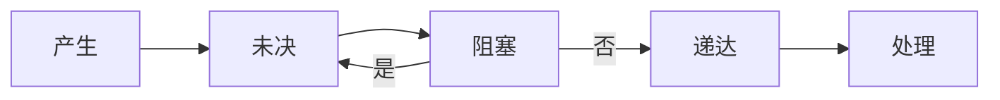

- [信号的生命周期](#信号的生命周期)
- [信号的处理方法](#信号的处理方法)
- [sigset\_t](#sigset_t)
- [发送信号](#发送信号)
- [等待信号](#等待信号)

---

# 信号的生命周期



* 未决信号集合：非排队信号使用未决位图，排队信号使用队列
* 阻塞信号集合：阻塞位图，阻塞所有集合中包含的信号，**阻塞而不是忽略，要区分开**，解除阻塞后会释放被阻塞的信号

---

# 信号的处理方法

* 默认：终止进程、暂停进程、忽略
* 忽略
* 自定义函数

```c
#include <signal.h>
// 成功返回之前的信号处理函数指针，失败返回SIG_ERR
void (*signal(int signum, void (*handler)(int)))(int);
```

* signum：要处理的信号编号（如 SIGINT、SIGTERM）；
* handler：信号处理函数，可选值：
  * SIG_IGN：忽略该信号；
  * SIG_DFL：恢复信号的默认行为；
  * 自定义函数指针：捕获信号并执行自定义逻辑

```c
#include <signal.h>

struct sigaction {
    // 信号处理函数（两种写法二选一）
    void (*sa_handler)(int);          // 简易版（同signal的handler）
    void (*sa_sigaction)(int, siginfo_t *, void *); // 高级版（可获取信号详情）
    sigset_t sa_mask;                 // 处理信号时要阻塞的信号集合
    int sa_flags;                     // 信号处理标志（关键）
    void (*sa_restorer)(void);        // 已废弃，无需关注
};

// 成功返回0，失败返回-1并设置errno
int sigaction(int signum, const struct sigaction *act, struct sigaction *oldact);
```

* sa_mask：处理当前信号时，内核会自动阻塞该集合中的信号（避免嵌套处理）；
* sa_flags：控制信号处理行为，常用值：
  * SA_RESTART：被信号中断的系统调用（如 read/write/sleep）自动重启；
  * SA_SIGINFO：使用sa_sigaction作为处理函数（可获取信号来源、附加数据）；
  * SA_RESETHAND：处理完信号后，恢复为默认行为（同 signal 的旧行为）；
  * SA_NODEFER：不阻塞当前信号（允许嵌套处理）。

**sa_mask区分于阻塞位图**
* sa_mask：仅限于处理这个信号的时候，不允许mask中包含的信号打断
* 阻塞位图：全局的，阻塞位图中包含的信号

---

# sigset_t

逻辑上是个位图，但是为了跨平台，实际上并不是简单的整型

```c
#include <signal.h>

// 清空信号集（全部置 0）
int sigemptyset(sigset_t *set);
// 填满信号集（全部置 1）
int sigfillset(sigset_t *set);
// 添加一个信号到集合
int sigaddset(sigset_t *set, int signum);
// 从集合删除一个信号
int sigdelset(sigset_t *set, int signum);
// 判断信号是否在集合中
int sigismember(const sigset_t *set, int signum);
```

```c
#include <signal.h>
// 修改 / 获取当前进程的 block 掩码表
int sigprocmask(int how, const sigset_t *set, sigset_t *oldset);
// 把当前未决信号集合读到 set 中
int sigpending(sigset_t *set);
```

---

# 发送信号

```c
#include <signal.h>
// 发信号给进程
int kill(pid_t pid, int signum);
// 发给自己
int raise(int signum);
// 发实时信号 + 数据
int sigqueue(pid_t pid, int signum, const union sigval value);
```

---

# 等待信号

```c
#include <unistd.h>
// 挂起，直到收到任意信号
int pause(void);
// 临时替换掩码 → 等待信号 → 恢复掩码（原子操作）
int sigsuspend(const sigset_t *mask);
```

---
